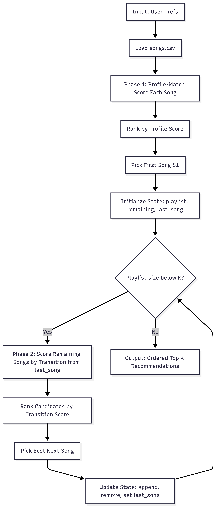
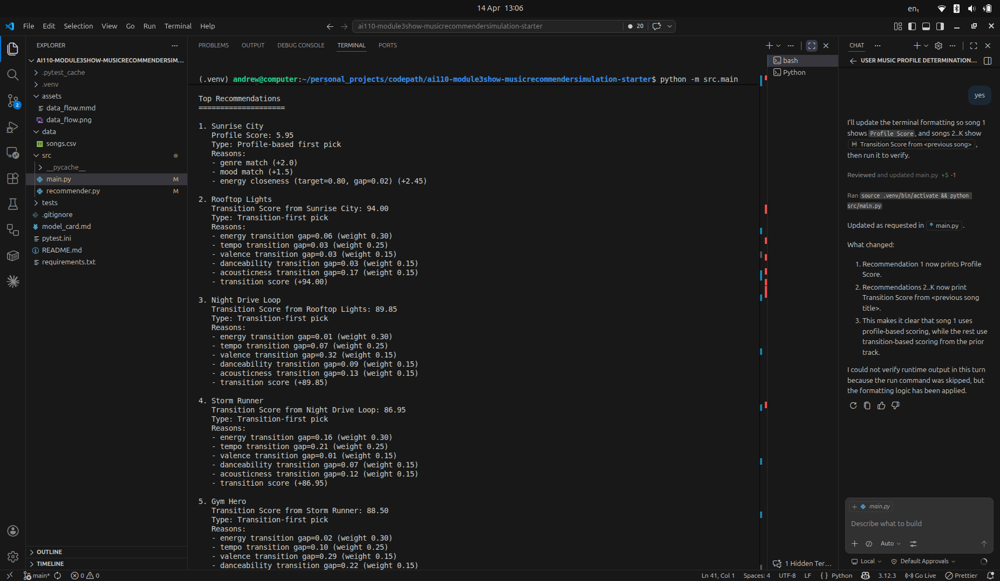

# 🎵 Music Recommender Simulation

## Project Summary

Smoothify is a small content-based music recommender that starts from a user's taste profile, picks an opening song, and then builds the rest of the playlist for smooth transitions. The system prioritizes track-to-track flow after the first recommendation, so later songs can drift from the original profile while still feeling coherent.

---

## How The System Works

Explain your design in plain language.

Some prompts to answer:

- What features does each `Song` use in your system
  - For example: genre, mood, energy, tempo
- What information does your `UserProfile` store
- How does your `Recommender` compute a score for each song
- How do you choose which songs to recommend

You can include a simple diagram or bullet list if helpful.

Real-world recommendation systems often combine user behavior and item attributes. A common distinction is collaborative filtering (learning from similar users) versus content-based filtering (learning from item features). This project uses a content-based approach because the available data is song-level metadata.

The main objective of this recommender is smooth transitions across a playlist. To support that goal, the most important features are the numeric audio attributes in the CSV: energy, tempo_bpm, valence, danceability, and acousticness. Identity and label fields such as id, title, artist, genre, and mood are still useful for filtering and explanation, but they are secondary for transition quality.

The UserProfile stores the starting preferences used to pick the first song:
- favorite_genre
- favorite_mood
- target_energy
- likes_acoustic
These values define the initial direction of the playlist before the system switches to transition-first selection.
  
### Recommendation Goal: Profile Start, Transition-First Sequence

This recommender uses a two-phase goal:

1. The user inputs a profile, and that profile is used to choose the first song.
2. After the first song, recommendations should prioritize transition quality between consecutive songs.

Transition quality is the main objective for the sequence. The playlist should optimize smooth flow from one song to the next based on numeric audio features (such as energy, tempo_bpm, valence, danceability, and acousticness), even if that means drifting away from the initial profile over time.

This design is intentional: there are no guardrails that force later songs to stay close to the original user profile.

### Data Flow Map 



### Finalized Algorithm Recipe

1. Collect user input: favorite_genre, favorite_mood, target_energy, likes_acoustic, and desired K.
2. Load all songs from the CSV into memory.
3. Compute a profile-match score for every song using the user input.
4. Rank songs by profile-match score and select the top song as the first playlist item.
5. Initialize playlist state: `playlist = [first_song]`, `remaining = all_other_songs`, `last_song = first_song`.
6. While the playlist has fewer than K songs, compute transition scores from `last_song` to each remaining candidate.
7. Rank remaining candidates by transition score and pick the highest-scoring next song.
8. Update state by appending the selected song, removing it from remaining candidates, and setting `last_song` to that song.
9. Repeat the loop until K songs are selected.
10. Return the ordered Top K playlist.

### Potential Bias Note

This system may over-prioritize smooth transition quality, which can repeatedly favor songs with similar audio profiles and reduce diversity. It may also under-recommend songs that are strong mood matches but require a larger feature jump from the current track.

---

## Getting Started

### Setup

1. Create a virtual environment (optional but recommended):

   ```bash
   python -m venv .venv
   source .venv/bin/activate      # Mac or Linux
   .venv\Scripts\activate         # Windows
  ```

2. Install dependencies

  ```bash
  pip install -r requirements.txt
  ```

3. Run the app:

  ```bash
  .venv/bin/python -m src.main
  ```

Example terminal output:



### Running Tests

Run the starter tests with:

```bash
.venv/bin/python -m pytest
```

You can add more tests in `tests/test_recommender.py`.

---

## Experiments You Tried

Use this section to document the experiments you ran. For example:

- What happened when you changed the weight on genre from 2.0 to 0.5
- What happened when you added tempo or valence to the score
- How did your system behave for different types of users

I ran profile-based experiments with three baseline profiles and three adversarial profiles.

- Baseline profiles: High-Energy Pop, Chill Lofi, Deep Intense Rock.
- Adversarial profiles: High-Energy Sad Acoustic, Acoustic Type Confusion, Out-of-Range and Noisy Text.
- Key finding: the first recommendation changed with profile inputs, but later recommendations often converged because transition smoothness dominates after the first pick.
- Edge-case finding: malformed input (for example, non-boolean likes_acoustic or noisy casing/spacing) reduced profile matching quality and made first-pick behavior less aligned with user intent.

---

## Limitations and Risks

Summarize some limitations of your recommender.

Examples:

- It only works on a tiny catalog
- It does not understand lyrics or language
- It might over favor one genre or mood

You will go deeper on this in your model card.

- The catalog is tiny (10 songs), so a few tracks can dominate recommendations.
- After the first song, the recommender prioritizes transition smoothness more than persistent profile fidelity.
- Exact text matching for genre and mood is brittle when input has casing or spacing issues.
- The system only uses metadata and does not account for lyrics, context, or evolving user feedback.

---

## Reflection

Read and complete `model_card.md`:

[**Model Card**](model_card.md)

Write 1 to 2 paragraphs here about what you learned:

- about how recommenders turn data into predictions
- about where bias or unfairness could show up in systems like this

Building Smoothify showed me how strongly recommender outputs depend on feature engineering and scoring order. Even with a simple model, the first pick and later picks can optimize different goals, which changes what users experience as "personalization."

I also learned that data cleanliness and input validation are essential. Small formatting issues or wrong input types can significantly change results, and a transition-first design can create a narrow filter bubble if profile preferences are not reintroduced later.

## Final Reflection

- What was your biggest learning moment during this project?
- How did using AI tools help you, and when did you need to double-check them?
- What surprised you about how simple algorithms can still "feel" like recommendations?
- What would you try next if you extended this project?

The biggest learning moment was considering the different decisions that the algorithm made that impacted how the final product works and who it is intended for. Due to the project prioritizing transitions it didn't take into considerations the user profile that much apart from the first song that it would choose, so the user would most likely be a person who would want to discover new music and not for people who just want to stick to a specific genre. It helped me with writing a lot of the code, but I still usually double checked it with the tests that they generated. And also when they were brainstorming the algorithm, because it wanted to defualt to preexisting ideas while I was redirecting the focus to smooth transitions. I hadn't thought previously about how a lot of the values or labels could be precalculated which made the choices more streamlined instead of recalculating everything every time, however I wonder what are the bigger impacts that this has on recommendation systems as maybe by preprocessing there is a threshold of personalization that cannot be surpassed. I already mentioned this but I would make it so that the user profile would have more of an impact. Additionally, more validation so that incorrect user profiles could be cleaned or rejected.
